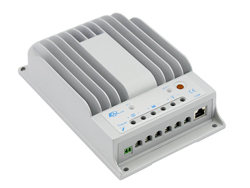
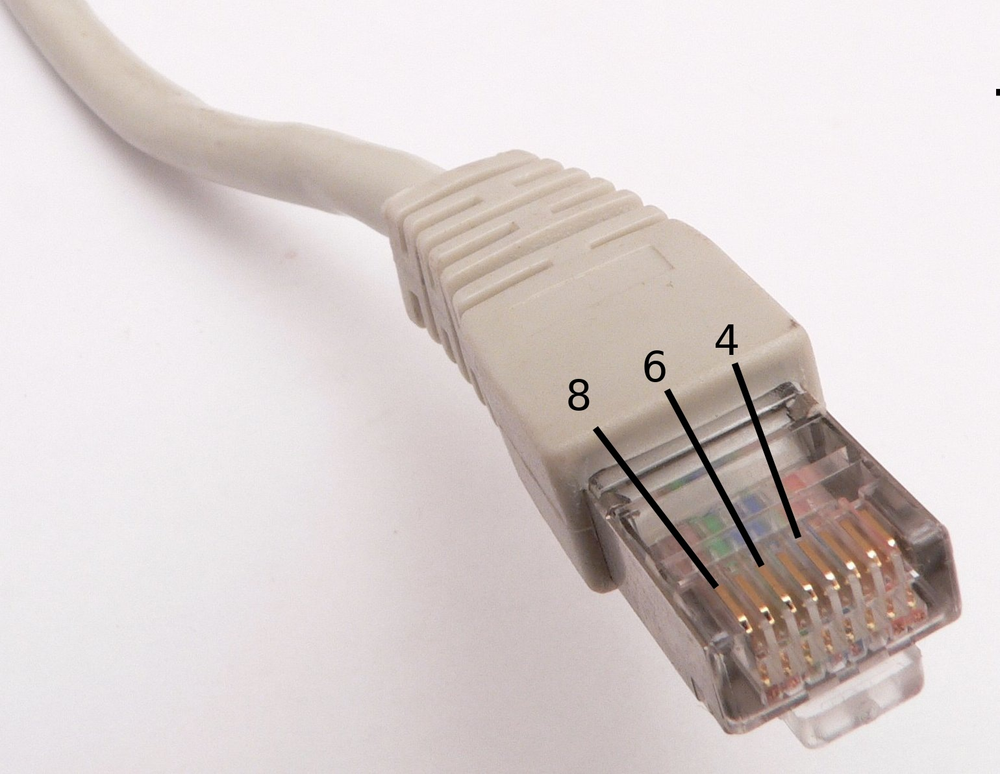

# epsolar-tracer
Tools for EPsolar Tracer A and BN solar charge controller
===================================================


This is the second generation of the EPsolar Tracer solar charge controller. 
You need RS-485 adapter for communication. The first generation controller 
used RS-232 and a different protocol. see https://github.com/xxv/tracer.

[Product link 1](http://www.epsolarpv.com/en/index.php/Product/pro_content/id/573/am_id/136)  
[Product link 2](http://www.epsolarpv.com/en/index.php/Product/index/id/653/am_id/134)  

Check [EPEVER site](https://www.epever.com/) for more info and Windows software.
There are also some [nice pictures](http://gwl-power.tumblr.com/tagged/tracer) on Tumblr.

Linux driver for Exar USB UART
------------------------------
NOTE If you have Linux kernel version 6.5 or newer, you don't need any special driver.
For example in Raspbian/bookworm:
```
kasper@zombie:~ $ uname -r
6.6.62+rpt-rpi-v8
kasper@zombie:~ $ lsmod | grep serial
xr_serial              16384  0
usbserial              40960  1 xr_serial
kasper@zombie:~ $ ls -l /dev/ttyUSB*
crw-rw---- 1 root dialout 188, 0 Jan 13 05:59 /dev/ttyUSB0
```

If you cannot use a new kernel, you may try this Linux driver in
[directory](xr_usb_serial_common-1a). That is for for Exar based USB RS-485 adapter. 
The original source was from Exar website, but it has dissapeared when MaxLinear acquired Exar.

Protocol
--------
[Protocol](archive/1733_modbus_protocol.pdf)
See for [windows capture](archive/epsolar.txt) for some extra commands.

Python module
-------------
Uses modbus library (https://github.com/bashwork/pymodbus)  
Example output
```
# python info.py 
Manufacturer: 'EPsolar Tech co., Ltd'
Model: 'Tracer2215BN'
Version: 'V02.05+V07.12'
Charging equipment rated input voltage = 150.0V
Charging equipment rated input voltage = 150.0V
Charging equipment rated input current = 20.0A
...
```
Wiring
------
Epsolar controller uses RJ45 connector. If you use other RS-485 adapter than Exar, you may create the cable from an Ethernet cable.
Check the colors from the following tables, your cable is typically T768B or T768A.
* Connect brown wire to adapter pin marked as GND if your adapter has the pin.
* Connect blue wire to the adapter pin marked as B or D-
* T768A: Connect orange wire to adapter pin marked as A or D+  OR
* T768B: Connect green wire to adapter pin marked as A or D+ .

The other pins are used by MT-50 display and not needed with USB adapter.

| Pin | Function  | Wire  | Eth. T768A  	| Eth. T768B  	|
|---	|---        |---	  |---	          |---	          |
| 1  	| Power     |   	  | White-Green   | White-Orange  |
| 2  	| Power     |   	  | Green         | Orange  	    |
| 3  	| RS-485-B  |       | White-Orange  | White-Green   |
| 4  	| RS-485-B  | D - 	| Blue          | Blue          |
| 5  	| RS-485-A  |       | White-Blue    | White-Blue    |
| 6  	| RS-485-A  | D +   | Orange  	    | Green         |
| 7  	| Ground 	  |   	  | White-Brown   | White-Brown   |
| 8  	| Ground 	  | GND	  | Brown	        | Brown	        |



